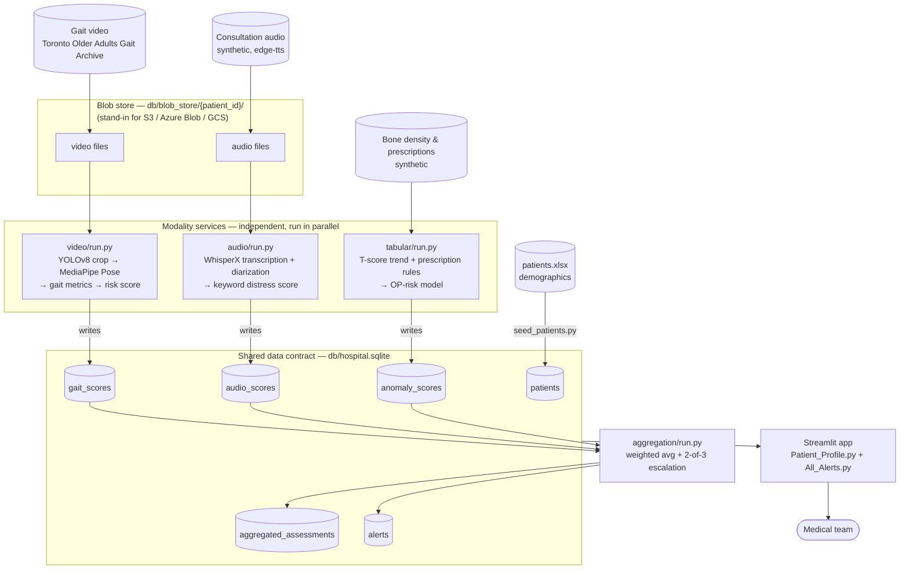

# Architecture

## Platform Narrative

The system is framed as a hospital's internal patient-monitoring platform for
osteoporosis follow-up care. Rather than one monolith trying to reason over
every input at once, the platform is built as a set of specialized backend
services, each responsible for consuming one type of clinical data as it
arrives — gait video from mobility assessments, consultation audio, lab/bone-
density results and prescriptions — and each independently extracting a
structured score or signal from its modality.

As new data lands for a patient (a new video, a new consultation recording, a
new lab result), the corresponding service picks it up, processes it, and
writes its finding into that patient's shared record — the same pattern a
real hospital integration engine would use, where each source system feeds
one canonical patient profile instead of living in its own silo. Because each
service only depends on its own input type, they can run independently and
concurrently — a new gait video being scored doesn't block a consultation
transcript from being processed at the same time.

Nothing in a single modality is enough on its own; a doctor reviewing a
patient sees each score building up individually over time (this
consultation's distress signal, that visit's gait risk, this quarter's bone
density trend), and a separate aggregation layer is what actually correlates
them into one fall/fracture-risk signal for the care team — mirroring the
real clinical problem, where the risk lives in the intersection of the data,
not in any one chart.

## Bridging Narrative and Implementation

The narrative above describes how the platform would behave in production: a
message system fielding uploads, services subscribed to their own queue, and
an aggregation layer reacting to every new message. This project doesn't
build that infrastructure — it builds a scaled-down stand-in that preserves
the same conceptual flow, and every place the two diverge is called out
below.

### Data arrival (blob store instead of a queue)

In production, a new gait video, consultation audio file, or lab result
would land in the platform through a message system (e.g. Kafka/RabbitMQ/SQS
carrying a "new file uploaded" event with a pointer to the object). Here,
that same "arrival" is simulated in two stages:

1. The `dataset/` generation scripts (sourcing the real gait video archive,
   synthesizing consultation audio scripts, synthesizing bone-density and
   prescription series) produce the raw files that stand in for what a
   patient upload would look like.
2. Those files are copied into `db/blob_store/{patient_id}/`, which plays the
   role of the durable object storage a message would point to (e.g. an S3
   bucket, Azure Blob Storage, or Google Cloud Storage) — the "this file has
   arrived and is ready to be processed" moment — without a literal message
   ever being published.

### Processing services (polling instead of listening)

In production, each service (video, audio, tabular) would be a long-running
consumer subscribed to its own topic, woken up on demand whenever a new
message for its modality arrives, processing that one file, and writing the
result to `hospital.sqlite`. In this implementation, each service's `run.py`
performs the equivalent reaction, but by scanning the blob store rather than
listening for an event — it's invoked manually/on demand instead of running
continuously and being triggered by a message. The processing logic itself
(video → gait score, audio → transcript + distress score, tabular → anomaly
detection) is the same work a real consumer would do on message receipt;
only the trigger mechanism is simulated.

### Aggregation (recomputing on demand instead of on every message)

The aggregation service represents the piece of the platform that would
listen to all three topics and re-run a patient's fused assessment every
time any one of their scores changes — a new gait video landing today should
immediately refresh yesterday's risk profile. Today, `aggregation/run.py` is
also invoked manually, after the other three services have already written
their scores for a batch of patients, rather than being triggered per
message. So the correctness of the aggregation logic is real, but the
"reacts live to new data" behavior is simulated by running it after the
fact.

### What's genuinely real vs. what's simulated

- **Real**: the per-modality processing algorithms, the DB writes, the
  isolated service boundaries and dependencies (each service has its own
  venv/requirements), the aggregation math.
- **Simulated**: the event/message layer that would trigger this work in
  production. Currently that's manual, sequential `run.py` execution instead
  of live, independently-triggered consumers.

This is a deliberate, scoped-down architecture choice, not a
misunderstanding of how a real deployment would behave.

## Multimodal Flow Diagram

## Multimodal Flow Description

Each patient's record is built up from four independent data sources: gait
video (sourced from the Toronto Older Adults Gait Archive), consultation
audio (synthetic, generated from tiered doctor/patient scripts), bone-density
and prescription history (synthetic, longitudinal), and static demographics
(`patients.xlsx`). Demographics are seeded once, directly into the
`patients` table, by `dataset/seed_patients.py` — they anchor every other
table's foreign key but aren't themselves a modality being scored.

Video and audio files land in `db/blob_store/{patient_id}/`, standing in for
an object-storage upload; the bone-density/prescription series is read
directly from its synthetic source, since it's tabular data rather than a
file artifact. From there, three modality services each consume only their
own input type and never call into one another's code:

- **`video/run.py`** crops each frame to the detected person with YOLOv8,
  runs MediaPipe Pose on the crop, derives gait metrics (cadence, step time)
  from the resulting joint trajectories, and writes a `risk_score` plus flags
  to `gait_scores` — one row per video segment.
- **`audio/run.py`** transcribes and diarizes the consultation with WhisperX,
  isolates the patient's turns, scores them for fatigue/pain/anxiety keyword
  mentions, and writes one `distress_score` row per file to `audio_scores`.
- **`tabular/run.py`** computes a T-score trend and prescription-change flags
  from the longitudinal bone-density/prescription series, runs the OP-risk
  classifier on the latest visit, and upserts one row per patient to
  `anomaly_scores`.

These three services have no dependency on each other's output and are
designed to run independently and concurrently — the schema itself is built
around this (`patients` is seeded up front specifically so the three
modality services never race to satisfy a foreign key). `hospital.sqlite` is
the single shared contract between them: no service reads another service's
table, only the aggregation layer does.

**`aggregation/run.py`** is the one component that reads across all three
modality tables. For each patient, it takes the latest `gait_scores`,
`audio_scores`, and `anomaly_scores` row, applies an explicit, documented
rule (`v1_equal_weight_2of3_escalation`: an equal-weighted average of the
three, escalated if at least two of the three individually clear a risk
threshold), and writes one traceable row to `aggregated_assessments` — with
foreign keys back to the exact three rows that produced it — plus an `alerts`
row when the combined risk is high enough to need medical attention.

Finally, the Streamlit app (`Patient_Profile.py` for a single patient's
longitudinal view across all three modalities, `pages/1_All_Alerts.py` for
the cross-patient alert queue) is the only consumer that talks to the
database directly for display — it never touches raw video/audio/tabular
files or processing logic, only the shared data contract. This is the layer
a doctor actually opens: individual modality scores building up over time,
and the fused risk/alert derived from them, in one place.

## Scope Decisions

Each choice below is a deliberate call made during development, disclosed
here on purpose rather than left for a reader to notice on their own.

### No cloud services

Every model (YOLOv8, MediaPipe Pose, WhisperX, pyannote) runs locally — no
Azure, AWS, or GCP SDK calls anywhere in the pipeline. This is a strategic
choice to invest effort in real dataset sourcing, local processing, and
validation rigor rather than managed-API integration glue.

### MediaPipe Pose instead of OpenPose

MediaPipe Pose is used for postural analysis instead of OpenPose — lighter,
MIT-licensed, no separate model-build step. It's also load-bearing, not just
convenient: on the Toronto archive's ceiling-mounted camera frames, MediaPipe
Pose alone detects the walker in 0 of 60 sampled frames, since the person
occupies too small a fraction of the frame. Cropping to a YOLOv8-detected
person box first is what makes pose detection work on this dataset at all —
so YOLOv8 and MediaPipe Pose compose as a two-stage pipeline out of
necessity.

### Audio distress score is a text-content proxy, not acoustic analysis

The distress score is keyword-stem matching (fatigue, pain, anxiety terms,
with a negation check) run on the **transcribed text** of the patient's
turns — not an acoustic/paralinguistic signal (pitch, rate, jitter, pauses).
No feature is ever extracted from the audio signal itself. This keeps the
algorithm simple and still captures a real clinical signal, but it is a
different sub-problem than analyzing *how* something is said, and is named
as such here.

### Anomaly-detection targets, as actually built

Three sub-targets were in scope; each got a defensible variant, not all
three literally:

- **Prescriptions** — built as specified: rule-based discontinuation/switch
  detection over the synthetic medication history.
- **Vitals** — reinterpreted as bone-density/lab longitudinal trend (T-score
  decline over time), since fall/fracture risk in this population doesn't
  naturally involve heart rate or blood pressure.
- **Movement patterns during hospitalization** — **not addressed**. The
  video pipeline scores gait risk from a single walking assessment per
  patient; there's no repeated, longitudinal movement tracking over a
  hospitalization. This is named here as a scoped-out target, not folded
  quietly into the gait result.

### Aggregation validation is partially circular

The sanity check that the two patients assigned a pre-determined "high risk"
tier (OAW04, OAW12) come out HIGH after aggregation is real, but only
partially independent evidence. Of the three inputs, only the **video** gait
score is an independently measured signal (derived from real gait-archive
footage). **Audio**'s consultation-script tier and **tabular**'s T-score
decline curve were both synthetically generated to match a risk tier decided
in advance (`docs/consultation_scripts.md`), since no real dataset combines
gait video, consultation audio, and bone-density history for the same
patients. So the check confirms the aggregation math correctly combines
three numbers, two of which were authored to already agree — not that three
independently observed signals converged on the same conclusion. This is an
inherent consequence of assembling synthetic patients from unrelated real
people, stated here so the validation claim isn't read as stronger
cross-modal evidence than it is.

## Models Applied per Data Type

### Video — gait analysis

- **YOLOv8** (`yolov8n.pt`, pretrained, person class only) crops each frame
  to the detected walker.
- **MediaPipe Pose** runs on the crop to extract joint landmarks.
- **Gait metrics**: cadence and step time, computed from hip-width-normalized
  left/right heel separation. A zero-lag Butterworth low-pass filter (8Hz)
  removes joint-trajectory jitter before step detection; hip width is
  normalized per frame (not per segment), since a participant's apparent
  scale changes substantially as they walk toward/away from the camera.
  Segments with fewer than 4 detected step events, or a computed cadence
  outside a physiologically plausible range (40–180 steps/min), are
  discarded rather than trusted.
- **Risk scoring**: cadence and step-time are each converted to a z-score
  against this cohort's own mean/SD, averaged, and mapped to a 0–100 score
  (50 = average); >1 SD worse than the cohort triggers an abnormal-gait flag.

### Audio — consultation transcription and diarization

- **Transcription**: WhisperX (Whisper ASR + forced alignment), medium
  model, pt-BR.
- **Diarization**: pyannote.audio via WhisperX's diarization pipeline,
  pinned to a known 2-speaker count (every consultation is a fixed
  doctor/patient dialogue). Speaker IDs are mapped to roles by turn order —
  the first speaker to talk is the doctor.
- **Distress scoring**: keyword-stem matching for fatigue, pain, and anxiety
  terms on the patient's diarized lines only, with a negation check so
  denials ("sem dor") aren't miscounted. Weighted 20/20/15 points per
  mention type, capped at 100; ≥50 flags as high distress.

### Tabular — bone density and prescriptions

Two independent signals, both rule-based by design — a doctor needs to know
*why* an alert fired, not just a model's confidence:

- **T-score decline**: flags a ≥0.5-point drop in femoral-neck T-score
  (FNT), either between any two consecutive visits or accumulated across the
  full visit history.
- **Prescription discontinuation**: flags any medication going from
  prescribed to stopped between consecutive visits.
- **OP-risk classifier**: a pretrained `RandomForestClassifier` (reused
  as-is from this project's earlier tabular-only phase, trained in
  [`module_01/analysis/bone-density-analysis.ipynb`](../../module_01/analysis/bone-density-analysis.ipynb))
  predicts
  osteoporosis-positive/negative on the patient's latest visit. Disclosed
  limitation: OP=1 recall is only 0.64, so roughly 4 in 10 real
  osteoporosis-positive cases are missed — attributed to class imbalance and
  under-representation in the training data.

### Aggregation — cross-modal fusion

An explicit, versioned rule (`v1_equal_weight_2of3_escalation`):

1. Combine the three modalities' latest 0–100 scores as an equal-weighted
   average.
2. Escalate to HIGH regardless of the average if at least 2 of the 3
   individual scores are ≥65.
3. Otherwise, map the combined score to LOW/MODERATE/HIGH by fixed terciles.

Every aggregated row keeps foreign keys back to the exact gait/audio/anomaly
rows that produced it, so any result is traceable to its inputs.

## Results and Validation

### Video: gait risk vs. clinical scores

Cadence and step time were validated against the 14 real Toronto
participants' clinical fall-risk scores (POMA-Balance, POMA-Gait, BBS, TUG).
After the corrections above, cohort-level cadence lands in a plausible range
and the cadence-vs-TUG correlation has the expected sign (negative — higher
cadence, lower fall risk), but its strength is weak (|r| ≈ 0.16) and not
statistically significant at n=14. This is disclosed as a real ceiling of a
single-camera heuristic step detector at the individual-participant level,
not a claimed strong result — the sign and plausible magnitude are genuine,
verified improvements over earlier iterations; per-participant correlation
strength is a stated limitation of this project's scope.

**Concrete example**: `OAW05`, video `OAW05-bottom`, segment 4 (pose
landmarks: `db/blob_store/OAW05/OAW05-bottom_landmarks.csv`) — cadence 46.2
steps/min, mean step time 1.30s, both well outside the cohort's normal
range, producing `risk_score` 100/100 and `flag_abnormal_gait=1`. This is
the kind of segment-level output the doctor-facing UI surfaces individually,
before any cross-modal aggregation happens.

### Audio: transcription and diarization accuracy

Every diarized transcript was checked line-by-line against its original
consultation script for all 14 participants. Transcription is essentially
exact — every line matches word-for-word, modulo trivial
punctuation/spacing normalization. Diarization (speaker separation) is fully
correct for 12 of 14 participants; the remaining 2 each have exactly one
misattributed turn (the doctor's closing remark merged into the preceding
patient turn) — a narrow, investigated edge case, not a systemic failure.

**Concrete example**: `OAW04`'s consultation audio
(`db/blob_store/OAW04/consultation.wav`) produced a `distress_score` of
80/100 from 1 fatigue and 3 pain mentions in the patient's diarized lines —
the same file and output referenced in the aggregation example below.

### Tabular: anomaly detection output

Across the 14 patients, `bone_density_risk_score` ranges from 0 (stable
T-score, no prescription change) to 84 (OAW04: T-score declining +1.08
points over the visit history, plus an unexpected prescription
discontinuation). The OP classifier's predictions and confidence scores are
written alongside the rule-based score so a doctor can see both the
cross-sectional read ("does this look osteoporotic") and the longitudinal
read ("is it getting worse") for the same patient.

**Concrete example**: `OAW04`'s visit history
(`db/blob_store/OAW04/bone_density_history.csv`) produced
`bone_density_risk_score` 84/100, `t_score_trend` "declining (+1.08 FNT
points over the visit history)", `prescription_flag=1` (an unexpected
medication discontinuation between visits), and an OP classifier output of
`op_prediction=1` at `op_prediction_confidence` 0.75 — the same output
referenced in the aggregation example below.

### Aggregation: concrete example

`OAW04` and `OAW12` are the two patients whose combined risk reaches HIGH. In
both cases the 2-of-3 escalation override is technically satisfied, but
isn't the deciding factor: the plain equal-weighted average alone already
clears the HIGH tercile (≥66.67/100) for both, so the override agrees with
the base rule rather than rescuing a patient the average would have missed.
The escalation rule exists (and is unit-tested) as a safety net for a
different shape of case — one very high score plus two moderate-but-not-low
ones that wouldn't average into HIGH on their own — which doesn't happen to
occur in this 14-patient cohort.

- **OAW04**: gait 67.5/100 (cadence 81.8 steps/min, step time 0.73s) —
  elevated, but below the video service's own, stricter `flag_abnormal_gait`
  threshold, so a video-only system using that flag would not catch this
  patient. Audio distress is 80/100 (1 fatigue + 3 pain mentions), already
  above audio's own `high_distress` flag on its own. Bone density risk is
  84/100 (T-score declining, plus an unexpected prescription
  discontinuation). Combined: HIGH (77.2/100).
- **OAW12**: gait 74.9/100 (cadence 73.5 steps/min) — also below the
  video-only abnormal-gait flag. Audio distress 80/100 (fatigue and anxiety
  mentioned, `high_distress` flag true on its own). Bone density risk
  51.4/100 — declining, but below the escalation threshold on its own.
  Combined: HIGH (68.8/100).

The real integration value in these two cases isn't "no single modality
would have flagged this patient" — audio alone already does, via its own
`high_distress` flag. It's that video and tabular corroborate audio's signal
with independently-derived numbers, and the aggregation layer turns three
separate per-modality reads into one calibrated score and a single
rationale a clinician can act on, instead of three disconnected outputs
they'd have to reconcile themselves.

## Next Steps

Realistic next iterations for each modality, building directly on the
limitations already disclosed above.

### Video

Clinical correlation is weak (r≈0.16 vs. the source paper's 0.79–0.87) — a
single-camera heuristic step detector is the ceiling here. Next step: move
toward a proper pose pipeline (multi-camera triangulation, or a pose model
fine-tuned on this population) to close that gap. Separately, only a single
walking assessment per patient exists today, so there's no view of movement
patterns *changing* over a hospitalization — the next iteration would add
repeated assessments over time and track the trend, not just one snapshot.

### Audio

The distress score is pure keyword-stem matching on transcribed text — it
has no access to tone, pitch, rate, or pauses, so it misses vocal signal
entirely. It's also a small, hardcoded word list, which won't cover every
way a real patient might phrase fatigue, pain, or anxiety in an unscripted
consultation — it's tuned to this dataset's authored dialogues, not
general-purpose. Next step: adopt a paid cloud speech-sentiment service
(e.g. Azure Speech + Text Analytics) for both broader term/sentiment
coverage and real acoustic/prosody analysis, while continuing to develop an
in-house model in parallel — both to reduce long-term dependence on an
external API, and because sending real consultation audio (patient PII and
medical content) to a third-party provider raises data-privacy and
compliance concerns (e.g. HIPAA/LGPD) that a fully local model avoids.

### Tabular

The OP-risk classifier's disclosed recall is 0.64 — it misses roughly 4 in
10 real osteoporosis-positive cases. Next step: retrain on a larger,
better-balanced dataset, or stop using it standalone and ensemble its output
with the rule-based anomaly score, so a low-confidence model prediction
doesn't outweigh a clear T-score decline.
