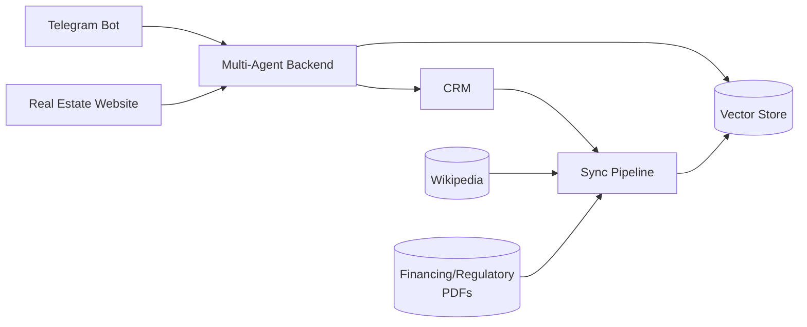

# Agente SDR Imobiliário

Multi-agent real estate SDR: a Telegram bot and a website chat widget both talk to a
LangGraph-based backend (real estate / mortgage advisor / follow-up agents) that's grounded
via RAG over a dummy CRM. See [`docs/architecture.md`](docs/architecture.md) for architecture, 
diagrams, and full feature list. See [`docs/demos.md`](docs/demos.md) for recorded demo videos.

## Requirements

- Docker + Docker Compose
- An OpenAI API key
- A Telegram bot token ([BotFather](https://core.telegram.org/bots#botfather)) — required even
  if you only plan to use the website chat, since `telegram_bot` is part of the stack

## Architecture: microservices around a multi-agent hub

Six services, each its own Docker container. Both client channels (website, Telegram) talk to
`agent_backend`, which runs the multi-agent logic and is the only service grounded via RAG
(Chroma, kept in sync from the CRM and external sources by `etl`).



See [`docs/architecture.md`](docs/architecture.md) for the full diagram, data stores, and
request-flow detail.

## Setup

```bash
make setup
```

‼️ Fill in `OPENAI_API_KEY` and `TELEGRAM_BOT_TOKEN` in the root `.env` before continuing.

```bash
make seed
```

## Run

```bash
make run
```

| Service | URL | Purpose |
|---|---|---|
| `website` | http://localhost:8501 | Property search + chat widget |
| `dashboards` | http://localhost:8502 | Broker agenda, lead stats, admin/observability |
| `crm` | http://localhost:8000 | Dummy CRM API (properties, visits) |
| `agent_backend` | http://localhost:8001 | Agent API (`/chat`, stats, summaries) |
| `etl` | http://localhost:8080 | CRM → Chroma sync pipeline |
| `telegram_bot` | — | Long-polls Telegram, no exposed port |

Stop all services with:

```bash
make down
```

## Tests

‼️ Requires the [setup](#setup) step to be finished first.

```bash
make qa
```

Runs `pytest` inside each service's container. Use `SERVICE=<name>` with `make logs` to tail a
single service's logs while the stack is running.

## Useful commands

```bash
# Simulate a price drop on a listing (triggers the follow-up agent's price-drop notification)
make drop-price PROPERTY_ID=<id> PRICE=<new_price>
```
