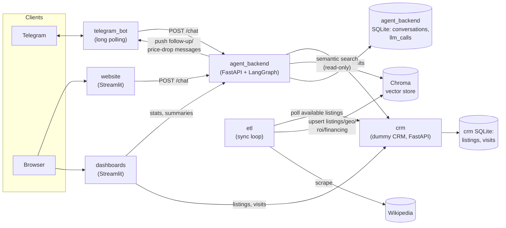
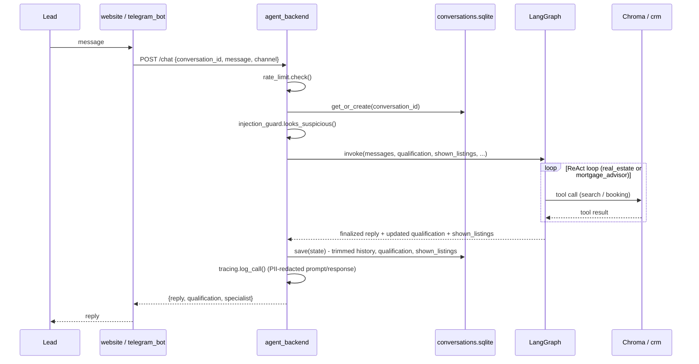
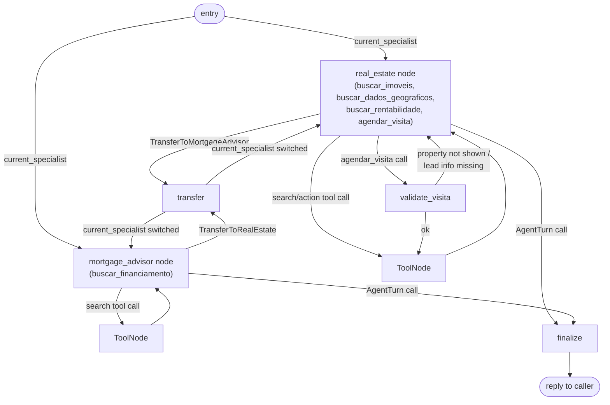

# Architecture

## Platform Narrative

The system is framed as a real estate agency's SDR (sales development rep) platform: the
automated front line that engages every inbound lead - from a website visitor to a message on
the agency's messaging channel - before a human broker ever gets involved. Rather than one
monolithic chatbot trying to do everything, the platform is built as a set of specialized
services, each owning one concern the way a real brokerage's tech stack would: a CRM as the
single system of record for inventory and bookings, a sync pipeline that keeps the agent's
knowledge current with that inventory, channel adapters that bridge each messaging surface into
one conversational core, and that core itself split into specialist agents the way a real sales
team splits property search from financing advice.

As a lead writes in, the corresponding channel adapter hands the message to the agent backend,
which qualifies the lead (what they want, budget, timeline), searches live inventory grounded in
the CRM's actual data - never a hallucinated listing - and hands off to a mortgage specialist the
moment the conversation turns to financing, mirroring how a real brokerage routes a financing
question to a loan officer instead of making the listing agent guess at rates. No single message
is enough to act on; a broker's picture of a lead builds up over many turns (what they're looking
for, what they've already been shown, whether they've gone cold) into one qualified profile - the
same conversation-continuity problem a real CRM hand-off has to solve, not something a stateless
reply-per-message bot could do.

Once a lead is qualified enough to visit a property, the platform books it directly into the CRM
the way a real transaction-management system would, and takes over the follow-up work a busy
broker would otherwise forget: nudging a lead who's gone quiet, or flagging a price drop on
something they'd already shown interest in. A broker never has to re-read a full transcript to
know where things stand - a generated summary and a live dashboard are what they actually open,
the same principle behind any CRM's activity feed.

## Bridging Narrative and Implementation

The narrative above describes how the platform would behave at a real brokerage: a
high-volume paid messaging channel, an existing multi-tenant CRM the agency already runs,
event-driven data sync, and infrastructure sized for many concurrent conversations. This project
doesn't build that - it builds a scoped-down stand-in that preserves the same conceptual flow,
and every place the two diverge is called out below.

### Messaging channel (Telegram instead of WhatsApp)

A real brokerage's leads would arrive through WhatsApp, the dominant channel for this market in
Brazil. WhatsApp's Business API is a paid, approval-gated product; Telegram's bot API is free and
requires no business verification, so it stands in here as the messaging channel while preserving
the same shape of integration - a channel adapter service (`telegram_bot`) that receives inbound
messages and forwards them, unmodified, to the same `/chat` endpoint the website widget uses. A
real integration would swap the adapter, not the agent backend.

### CRM (a narrow dummy service instead of a commercial multi-tenant CRM)

A real agency already runs a CRM/ERP (e.g. Vista CRM, Jetimob) that owns inventory and bookings,
and exposes that data to integrators over a REST API only - never direct database access, for the
same tenant-isolation reasons a portal aggregator (ZAP Imóveis, VivaReal) never gets one either.
`services/crm` is a deliberately narrow stand-in for that system - one table for listings, one for
visits, no auth, no multi-tenancy - but it preserves the real access boundary: `etl` and
`agent_backend` only ever talk to it over HTTP, never touch its SQLite file directly, exactly as a
real integration would be forced to.

### Inventory sync (polling instead of event-driven)

A real sync pipeline would react to a webhook or change-data-capture stream the moment a listing
is added, priced, or sold. `etl` has no such event source to subscribe to, so it polls the CRM's
`GET /properties` on an interval (`ETL_POLL_INTERVAL_SECONDS`) and diffs against each listing's
`updated_at` to decide what actually needs re-embedding - the same "did anything change"
question an event would have answered directly, just asked on a timer instead of being told.

### Background outreach (demo-scaled polling instead of production cadence)

The follow-up, price-drop, and broker-summary loops are the same kind of timer-driven polling as
`etl`'s sync, checking conversations for inactivity or price changes on an interval
(`FOLLOWUP_POLL_INTERVAL_SECONDS`, `SUMMARY_POLL_INTERVAL_SECONDS`) rather than reacting to an
event (a listing's price actually changing, a conversation actually going idle). The intervals
themselves are also compressed for demo purposes - a lead is considered "gone quiet" after two
minutes (`FOLLOWUP_INACTIVITY_SECONDS`), not the hours or days it would realistically take in
production - so the same mechanism that would run on a day-scale cadence at a real brokerage is
observable within a short demo recording instead.

### Knowledge bases (one-time scrape/static seed instead of licensed live feeds)

The geo-enrichment corpus is scraped once per city from Wikipedia rather than sourced from a
licensed demographics/market-data provider a real agency might subscribe to, and the financing
knowledge base is a small set of static seed PDFs rather than a live feed from a bank or
regulator. Both stand in for "grounded in real external data source" without the cost or
integration effort a production data contract would require - the RAG mechanism they feed
(`chroma_store`, `search.py`) doesn't care where the source data came from.

### Storage and scaling (single-container state instead of managed, distributed infrastructure)

Each service's SQLite file and `agent_backend`'s in-memory rate limiter assume a single running
instance - correct for this project's one-container-per-service deployment, but not something
that would survive being horizontally scaled behind a load balancer without swapping in a shared
database and a distributed rate limiter (e.g. Redis). Cloud deployment itself is out of scope by
explicit project decision, so this gap was never closed.

### What's genuinely real vs. what's simulated

- **Real**: the qualification/hand-off/booking logic, the RAG grounding and its guardrails
  (never inventing a listing or a rate), the validation before a visit reaches the CRM, the
  follow-up/price-drop/summary logic itself, the observability and security instrumentation.
- **Simulated**: the messaging channel (Telegram stands in for WhatsApp), the CRM (a narrow
  service stands in for a commercial multi-tenant one), how inventory changes are noticed
  (polling stands in for events/webhooks), the pace of background outreach (minutes stand in for
  days), and the knowledge bases' sourcing (one-time scrape/static seed stands in for a licensed
  live feed).

This is a deliberate, scoped-down architecture choice, not a misunderstanding of how a real
deployment would behave.

## System overview

Every service is a separate Docker container (`docker-compose.yml`), each owning its own
SQLite database where relevant. `agent_backend` is the only service with a real LLM dependency
(OpenAI); `crm` is a plain CRUD API standing in for a real estate agency's CRM/ERP.

## Services

| Service | Tech | Port | Responsibility |
|---|---|---|---|
| `crm` | FastAPI + SQLite | 8000 | Source of truth for property listings and visit bookings. |
| `etl` | FastAPI + background thread | 8080 | Polls `crm`, keeps 4 Chroma collections in sync (listings, geo, ROI, financing docs). |
| `agent_backend` | FastAPI + LangGraph + SQLite | 8001 | Multi-agent chat API, conversation persistence, RAG tools, visit booking, follow-up/price-drop/summary background loops, observability tracing. |
| `telegram_bot` | FastAPI + long polling | 8090 | Bridges Telegram ⇄ `agent_backend`; exposes `/push` so `agent_backend` can send unprompted messages. |
| `website` | Streamlit | 8501 | Public property search + chat widget. |
| `dashboards` | Streamlit | 8502 | Broker visit agenda, company-wide lead/property stats, admin observability page. |

## Data stores

| Store | Owner | Contents |
|---|---|---|
| `services/crm/db/listings.sqlite` | `crm` | `listings`, `listing_photos`, `visits` tables. |
| `services/agent_backend/db/conversations.sqlite` | `agent_backend` | `conversations` (history, qualification, shown listings, summary), `llm_calls` (tracing). |
| `data/chroma/` | `etl` (write), `agent_backend` (read-only mount) | 4 Chroma collections: `listings`, `geo`, `roi_summary`, `financing_kb`. |
| `services/telegram_bot/data/last_update_id.txt` | `telegram_bot` | Long-poll offset, so a restart doesn't replay old updates. |

## Chat request flow

Both channels funnel into the same endpoint; the sequence below is the same regardless of
whether the lead is on Telegram or the website.

Conversation state is entirely server-side, keyed by `conversation_id` (a UUID from the
website, the Telegram `chat_id` for the bot). Callers only ever send the new message text - the
graph is re-invoked fresh each turn with the persisted history, qualification, and shown
listings loaded back in.

## Agent orchestration (LangGraph)

`agent_backend/src/graph.py` builds a graph with two LLM-driven specialist nodes and three
deterministic nodes:

Key mechanics:

- **Structured final answer, not a separate extraction pass.** Both specialists are bound with
  `tool_choice="required"` alongside their search tools and an `AgentTurn` pseudo-tool. Calling
  `AgentTurn` is how the model commits to a natural-language reply *and* any newly-mentioned
  `Qualification` fields in one shot. After 3 tool results in a turn, `tool_choice` is narrowed
  to force `AgentTurn` specifically, so the model can't loop forever re-querying search tools.
- **Hand-off is bidirectional and stateful.** `TransferToMortgageAdvisor` / `TransferToRealEstate`
  are tool calls like any other; `transfer_node` just records the notice (OpenAI requires a
  `ToolMessage` reply to every `tool_calls` message) and flips `current_specialist`, which
  `entry_router` uses to route the *next* turn straight to the right specialist without
  re-explaining context.
- **Qualification accumulates, never regresses.** `merge_qualification` only overwrites a field
  when the new turn actually mentions it (`exclude_none`), so partial answers across many turns
  build up a complete `Qualification` (intent, price range, rooms, region, urgency, and
  intent-specific fields for rent/invest) without the model re-asking what it already knows.
- **Visit booking is validated before it reaches the CRM.** `validate_visita_node` rejects
  `agendar_visita` calls where the `property_id` wasn't actually shown to this lead in this
  conversation (`shown_listings`), or where `nome_lead`/`contato_lead` weren't literally stated by
  the client (`_stated_by_client`, phone numbers compared digit-only). Both cases return a
  `ToolMessage` error the model can relay, rather than ever hitting `POST /visits` with
  fabricated data.
- **`shown_listings` is reconstructed from tool results each turn** (`_shown_listings_from_this
  turn`), not asked of the model - it scans `buscar_imoveis` results in this turn's messages, so
  later validation and follow-up notifications work off real search results.
- Replies get a listing-detail link appended for every property shown that turn, and a
  hand-off banner prepended when a transfer just happened.

### Guardrails around the `/chat` endpoint

- **Rate limiting** (`rate_limit.py`): sliding window per `conversation_id`
  (`RATE_LIMIT_MAX_REQUESTS` per `RATE_LIMIT_WINDOW_SECONDS`), returns HTTP 429 past the limit.
- **Prompt-injection detection** (`injection_guard.py`): regex patterns for
  instruction-override/role-override/system-prompt-extraction attempts. Detection is
  logging-only, not blocking - both system prompts already instruct the model to treat search
  results as untrusted data, never instructions, so a flagged message is still answered normally
  but shows up in the observability page.
- **PII redaction** (`redact.py`): emails, phone numbers, and any lead name/contact explicitly
  captured via `agendar_visita` are scrubbed before a prompt/response is persisted to the
  `llm_calls` trace table - the only place full message text is ever stored.
- **Observability tracing** (`tracing.py`): one `llm_calls` row per `/chat` turn (not per
  internal LLM call within the ReAct loop) - latency, input/output tokens, which RAG tool
  results were used (ids only), redacted prompt/response, error, injection flag. Aggregated by
  `GET /stats/observability` and shown on the dashboards' admin page.

## Background loops (`agent_backend`)

All three run as daemon threads started in `main.py`'s FastAPI `lifespan`, independent of the
`/chat` request path:

| Loop | Interval | What it does |
|---|---|---|
| Follow-up (`followup.py`) | `FOLLOWUP_POLL_INTERVAL_SECONDS` | For Telegram conversations idle past `FOLLOWUP_INACTIVITY_SECONDS`, finds a shown-but-not-booked listing and nudges the lead once (`telegram_bot`'s `/push`). |
| Price drop (`price_drop.py`) | shares the follow-up loop's cadence | For every listing shown in a Telegram conversation, re-checks its current CRM price; notifies the lead if it dropped since it was last shown/notified. |
| Broker summary (`summary.py`) | `SUMMARY_POLL_INTERVAL_SECONDS` | For conversations idle past `SUMMARY_IDLE_SECONDS` with no summary yet, generates a Portuguese LLM summary of the conversation for the broker. Uses an optimistic-concurrency guard (`set_summary` only writes if `last_active_at` hasn't changed) so a summary in flight is never overwritten by a fresher `NULL` from a new incoming message. |

Follow-up and price-drop nudges are Telegram-only (`telegram_bot`'s `/push` needs a `chat_id`);
the website channel has no equivalent push mechanism.

## RAG corpora

`etl`'s poll loop (`POLL_INTERVAL_SECONDS`) keeps four Chroma collections in sync, each backing
one `agent_backend` tool:

| Collection | Source | Sync strategy | Backing tool |
|---|---|---|---|
| `listings` | `crm` `GET /properties` (available only) | Diffed on `updated_at`; stale ids (sold/rented/removed) deleted. | `buscar_imoveis` |
| `geo` | Wikipedia (Vale do Paraíba region page + per-city pages) | Scraped once per city, cached indefinitely (city geography doesn't change). | `buscar_dados_geograficos` |
| `roi_summary` | Derived from `listings` (gross yield = avg annual rent / avg sale price, per city+neighborhood+property_type segment) | Recomputed only for segments whose underlying listings just changed. | `buscar_rentabilidade` |
| `financing_kb` | Static PDFs in `services/etl/seed_data/financing_docs/` | Diffed on file content hash. | `buscar_financiamento` |

`agent_backend` mounts `data/chroma` **read-only** - it only ever queries, `etl` is the sole
writer. `chroma_store.is_ready()` gates `/chat` until the `listings` collection has at least one
document, so the agent never answers before the index is populated.

## CRM service

Dummy source of truth, deliberately narrow scope (inventory + visit booking, no auth, no
payments):

| Endpoint | Purpose |
|---|---|
| `GET /properties` | List/filter listings (`listing_type`, `city`, `property_type`, price range, `rooms`, `status`, sort, pagination). Defaults to `status=available`. |
| `GET /properties/{id}` | Single listing detail. |
| `POST /properties` | Create a listing (used by seed data). |
| `PATCH /properties/{id}` | Update price and/or status (used by `make drop-price` and manual demo scripting). |
| `POST /visits` | Book a visit; rejects if the property doesn't exist, isn't `available`, or the requested time isn't in the future. |
| `GET /visits` | List/filter visits by `conversation_id`, `property_id`, `status`. |

Photos are served from `/static/photos`; `listings`/`visits` live in one SQLite file mounted as
a volume so data survives container restarts.

## Telegram bot

Single long-polling thread against the Telegram Bot API (`GETUPDATES_TIMEOUT_SECONDS` long-poll
window), persisting its offset to disk so a restart doesn't reprocess old updates. Every text
message is forwarded verbatim to `agent_backend`'s `/chat` with `channel="telegram"`; `/start`
gets a canned greeting without hitting the agent. A `/push` endpoint lets `agent_backend`'s
follow-up and price-drop loops send unprompted messages to a `chat_id`.

Known limitation: Telegram strips hyperlinks that aren't publicly hosted, so listing-detail
links (which point at `localhost:8501`) don't render as clickable links in that channel.

## Website & dashboards (Streamlit)

**`website`** (public):
- `Buscar_Imóveis` - filterable property search (listing type, city, property type, price
  range, rooms, sort) against `crm`.
- `1_Detalhes_do_Imóvel` - single listing detail page, deep-linkable via `?listing_id=`  (this is
  what the agent's chat replies link to).
- `2_Assistente_Virtual` - the chat widget; talks to `agent_backend`'s `/chat`, keeps
  `conversation_id`/history in `st.session_state`, shows a specialist-specific avatar
  (🏠 real estate / 🏦 mortgage advisor).

**`dashboards`** (internal):
- `Agenda_do_Corretor` - broker's visit calendar, past and upcoming, with listing photo/price.
- `1_Visão_Geral` - company-wide snapshot: client count, available rentals/sales, closed deals
  (last 30 days), total bookings, cold-lead count.
- `2_Propriedades_e_Demanda` - most/least-sought properties (by visit count), lead intent
  breakdown (buy/rent/invest/unknown).
- `3_Observabilidade_(Admin)` - LLM call count, avg/p95 latency, token usage, error rate,
  injection-suspected count, recent call log. Visually flagged as an internal engineering page
  (🔒 icon + banner); not access-controlled - a deliberate scope cut for this POC, not an
  oversight.

Both apps hit `crm` and/or `agent_backend` over the internal Docker network
(`CRM_INTERNAL_URL`, `AGENT_BACKEND_INTERNAL_URL`), falling back to a Streamlit error banner
if either is unavailable rather than crashing the page.

## Functionality

### Core conversational flow

- Lead qualification (intent: buy/rent/invest, plus scenario-specific fields) accumulated
  silently across turns, never re-asked once known.
- Two-specialist hand-off (real estate ⇄ mortgage advisor) with context preserved across the
  switch.
- RAG-grounded answers for property search, city/region questions, investment yield, and
  financing questions - the model is instructed to never state a price, rate, or property detail
  that didn't come from a tool result.
- Visit scheduling validated against what was actually shown/said in the conversation, then
  persisted as a real CRM booking.
- Same backend serves both the Telegram bot and the website chat widget identically; a
  conversation is portable across restarts (state lives in SQLite, not memory).

### Automated outreach

- Inactivity follow-up nudge for a shown-but-unbooked listing (Telegram only).
- Price-drop notification when a previously shown listing's price falls (Telegram only,
  `make drop-price` for demoing it).
- Background broker-summary generation once a conversation goes idle.

### Broker/admin tooling

- Visit agenda, company KPIs, and property/demand ranking dashboards, all reading live from
  `crm` and `agent_backend`.
- Observability page over real LLM call traces (latency, tokens, RAG sources used, injection
  flags) - not just app logs.

### Security

- Rate limiting on `/chat`, keyed by `conversation_id`, uniform across both channels.
- Prompt-injection detection (log + flag, not block) plus explicit system-prompt instructions
  treating all RAG/tool output as untrusted data.
- PII redaction before any prompt/response text is persisted.

### Out of scope (by design)

- Voice AI, cloud deployment, dashboard access control, funnel/drop-off analytics, and
  long-term conversational-memory summarization (beyond the sliding history window) were all
  deliberately excluded to fit the project's scope and deadline - not unfinished work.
